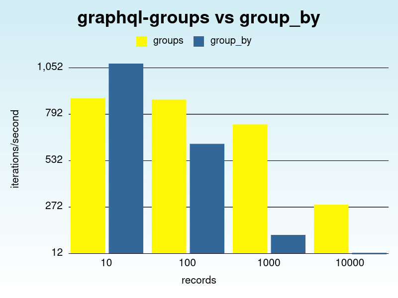

# GraphQL Groups

[](https://badge.fury.io/rb/graphql-groups)
[](https://github.com/hschne/graphql-groups/workflows/Build/badge.svg)
[](https://codeclimate.com/github/hschne/graphql-groups/maintainability) 
[](https://codeclimate.com/github/hschne/graphql-groups/test_coverage)

Statistics and aggregates built on top of [graphql-ruby](https://github.com/rmosolgo/graphql-ruby).

## Installation

Add this line to your application's Gemfile and run `bundle install`.

```ruby
gem 'graphql-groups'
```
```bash
$ bundle install
```

## Usage

Suppose you want to get the number of authors, grouped by their age. Create a new group type by inheriting from `GraphQL::Groups::GroupType`:

```ruby
class AuthorGroupType < GraphQL::Groups::GroupType
  scope { Author.all }

  by :age
end
```

Include the new type in your schema using the `group` keyword, and you are done.

```ruby
class QueryType < GraphQL::Schema::Object
  include GraphQL::Groups

  group :author_group_by, AuthorGroupType
end
```

You can then run a query to retrieve statistical information about your data, for example the number of authors per age.

```graphql
query myQuery{ 
  authorGroupBy {
    age {
      key
      count
    }
 }
}
```
```json
{
  "authorGroupBy":{
    "age":[
      {
        "key":"31",
        "count":1
      },
      {
        "key":"35",
        "count":3
      },
      ...
    ]
  }
}
```

## Why? 

`graphql-ruby` lacks a built in way to retrieve statistical data, such as counts or averages. It is possible to implement custom queries that provide  this functionality by using `group_by` (see for example [here](https://dev.to/gopeter/how-to-add-a-groupby-field-to-your-graphql-api-1f2j)), but this performs poorly for large amounts of data. 

`graphql-groups` allows you to write flexible, readable queries while leveraging your database to aggreate data. It does so by performing an AST analysis on your request and executing exactly the database queries needed to fulfill it. This performs much better than grouping and aggregating in memory. See [performance](#Performance) for a benchmark.

## Advanced Usage

#### Grouping by Multiple Attributes

This library really shines when you want to group by multiple attributes, or otherwise retrieve complex statistical information
within a single GraphQL query. 

For example, to get the number of authors grouped by their name, and then also by age, you could construct a query similar to this: 

```graphql
query myQuery{ 
  authorGroups {
    name {
      key
      count
      groupBy {
       age {
        key
        count
       }
      }
    }
 }
}
``` 

```json
{
  "authorGroups":{
    "name":[
      {
        "key":"Ada",
        "count":2,
        "groupBy":  {
          "age": [
            {
            "key":"30",
            "count":1
            },
            {
            "key":"35",
            "count":1
            }
          ]     
        }
      },
      ...
    ]
  }
}
```

`graphql-groups` will automatically execute the required queries and return the results in a easily parsable response.

#### Custom Grouping Queries

To customize which queries are executed to group items, you may specify the grouping query by creating a method of the same name in the group type.

```ruby
class AuthorGroupType < GraphQL::Groups::Schema::GroupType
  scope { Author.all }

  by :age

  def age(scope:)
    scope.group("(cast(age/10 as int) * 10) || '-' || ((cast(age/10 as int) + 1) * 10)")
  end
end
```

You may also pass arguments to custom grouping queries. In this case, pass any arguments to your group query as keyword arguments.

```ruby
class BookGroupType < GraphQL::Groups::Schema::GroupType
  scope { Book.all }

  by :published_at do
    argument :interval, String, required: false
  end

  def published_at(scope:, interval: nil)
    case interval
    when 'month'
      scope.group("strftime('%Y-%m-01 00:00:00 UTC', published_at)")
    when 'year'
      scope.group("strftime('%Y-01-01 00:00:00 UTC', published_at)")
    else
      scope.group("strftime('%Y-%m-%d 00:00:00 UTC', published_at)")
    end
  end
end
```

When defining a group type's scope you may access the parents `object` and `context`. 

```ruby
class QueryType < GraphQL::Schema::Object
  field :statistics, StatisticsType, null: false

  def statistics
    Book.all
  end
end

class StatisticsType < GraphQL::Schema::Object
  include GraphQL::Groups

  group :books, BookGroupType
end

class BookGroupType < GraphQL::Groups::Schema::GroupType
  # `object` refers to `Book.all`
  scope { object.where(author_id: context[:current_person]) }

  by :name
end
```

For more examples see the [feature spec](./spec/graphql/feature_spec.rb) and [test schema](./spec/graphql/support/test_schema.rb)

### Custom Aggregates

Per default `graphql-groups` supports aggregating `count` out of the box. If you need to other aggregates, such as sum or average 
you may add them to your schema by creating a custom `GroupResultType`. Wire this up to your schema by specifying the result type in your
group type.

```ruby
class AuthorGroupResultType < GraphQL::Groups::Schema::GroupResultType
  aggregate :average do
    attribute :age
  end
end
```

```ruby
class AuthorGroupType < GraphQL::Groups::Schema::GroupType
  scope { Author.all }

  result_type { AuthorGroupResultType }

  by :name
end
```

Per default, the aggregate name and attribute will be used to construct the underlying aggregation query. The example above creates
```ruby
scope.average(:age)
```

If you need more control over how to aggregate you may define a custom query by creating a method matching the aggregate name. The method *must* take the keyword arguments `scope` and `attribute`. 

```ruby
class AuthorGroupResultType < GraphQL::Groups::Schema::GroupResultType
  aggregate :average do
    attribute :age
  end

  def average(scope:, attribute:)
    scope.average(attribute)
  end
end
```

For more examples see the [feature spec](./spec/graphql/feature_spec.rb) and [test schema](./spec/graphql/support/test_schema)

## Performance

While it is possible to add grouping to your GraphQL schema by using `group_by` (see [above](#why)) this performs poorly for large amounts of data. The graph below shows the number of requests per second possible with both implementations.



The benchmark queries the author count grouped by name, using an increasing number of authors. While the in-memory approach of grouping works well for a small number of records, it is outperformed quickly as that number increases.

Benchmarks are generated using [benchmark-ips](https://github.com/evanphx/benchmark-ips). The benchmark script used to generate the report be found [here](./benchmark/benchmark.rb)

## Limitations and Known Issues

*This gem is in early development!* There are a number of issues that are still being addressed. There is no guarantee
that this libraries API will not change fundamentally from one release to the next. Please refer to the [issue tracker](https://github.com/hschne/graphql-groups/issues) for a list of known issues.

## Credits

<a href="https://www.meisterlabs.com"></a>

[graphql-groups](https://github.com/hschne/graphql-groups) was created at [meister](https://www.meisterlabs.com/)

## Development

After checking out the repo, run `bin/setup` to install dependencies. Then, run `rake spec` to run the tests. You can also run `bin/console` for an interactive prompt that will allow you to experiment.

To install this gem onto your local machine, run `bundle exec rake install`. To release a new version, update the version number in `version.rb`, and then run `bundle exec rake release`, which will create a git tag for the version, push git commits and tags, and push the `.gem` file to [rubygems.org](https://rubygems.org).

## Contributing

Bug reports and pull requests are welcome on GitHub at https://github.com/hschne/graphql-groups. This project is intended to be a safe, welcoming space for collaboration, and contributors are expected to adhere to the [Contributor Covenant](http://contributor-covenant.org) code of conduct.

## License

The gem is available as open source under the terms of the [MIT License](https://opensource.org/licenses/MIT).

## Code of Conduct

Everyone interacting in the Graphql::Groups project’s codebases, issue trackers, chat rooms and mailing lists is expected to follow the [code of conduct](https://github.com/[USERNAME]/graphql-groups/blob/master/CODE_OF_CONDUCT.md).
